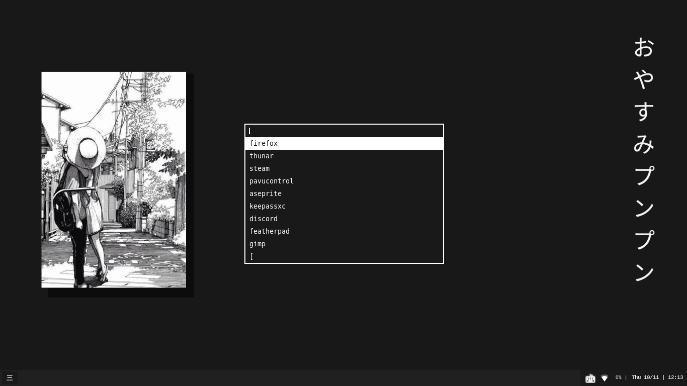

### dmenu with patches and dmenu_run_history script

#### Patches applied (8 total):

- Border
- Case insensitive
- Center
- Fuzzymatch
- Highlight
- High priority
- Line below prompt
- Line height
- Mouse Support

Paste dmenu_run_history into your ~/.local/bin so you can run it from anywhere you want.

